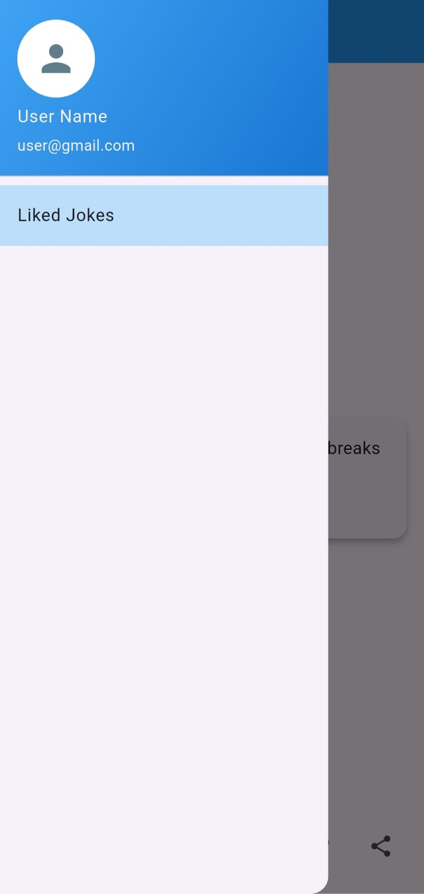

# **🌟 RANDOM JOKES GENERATOR**

**Random Jokes Generator** is a fun and interactive Flutter app that fetches jokes from an API and allows users to save, like, and share their favorite jokes. Built with Flutter and Provider for state management, this app also utilizes Shared Preferences to store liked jokes locally.

---

## 🚀 Features

- **💡 Random Jokes Display**  
  Get a fresh joke each time you refresh the app.
  
- **🌐 API Integration**  
  Fetch jokes from a reliable API.
  
- **📃 Save & Like Jokes**  
  Store your favorite jokes using Shared Preferences.
  
- **🎬 View Liked Jokes**  
  Access and manage your liked jokes in a separate screen.
  
- **🔍 Remove Liked Jokes**  
  Delete saved jokes from local storage easily.
  
- **📢 Share Jokes**  
  Share jokes on social media and messaging apps.
  

---

## 🎥 Screens

- **Splash Screen**  
- **Home Page** (Displays random jokes)  
- **Liked Jokes Page** (Shows saved jokes)  

---

## 🛠 Tech Stack

- **Flutter** - Cross-platform app development  
- **Dart** - Programming language  
- **Provider** - State management  
- **Shared Preferences** - Local storage  
- **REST API** - Fetching jokes  

---

## 🔧 Installation

1. **Clone the repository**
   ```bash
   git clone https://github.com/your-username/random-jokes-generator.git
   cd random-jokes-generator
   ```
2. **Install dependencies**
   ```bash
   flutter pub get
   ```
3. **Run the app**
   ```bash
   flutter run
   ```

---

## 🎨 UI Previews





---

## 📌 Future Enhancements

- 🛹 Category-wise joke filtering  
- 🌐 Offline joke saving  
- ⚖️ Multiple joke APIs integration  

---

## 🤝 Contributing

Contributions are welcome! Feel free to open issues or submit pull requests.

---

## 📚 License

This project is licensed under the **MIT License**.

---

## 🌟 Show Your Support

If you like this project, please ⭐ the repository!

